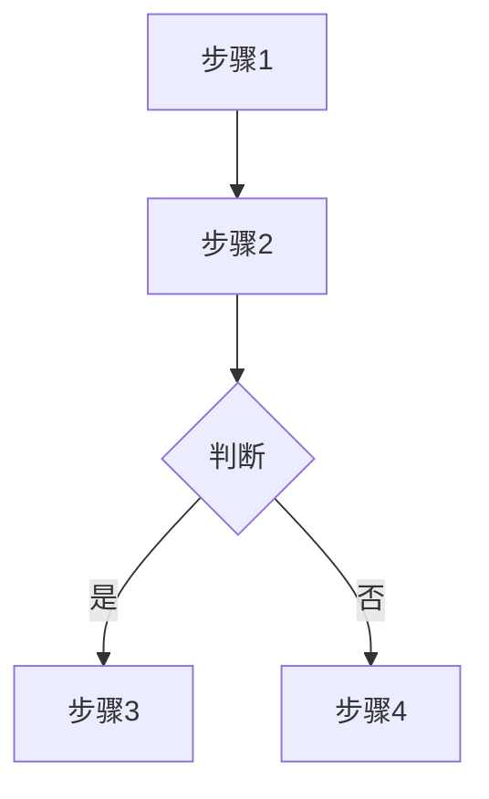
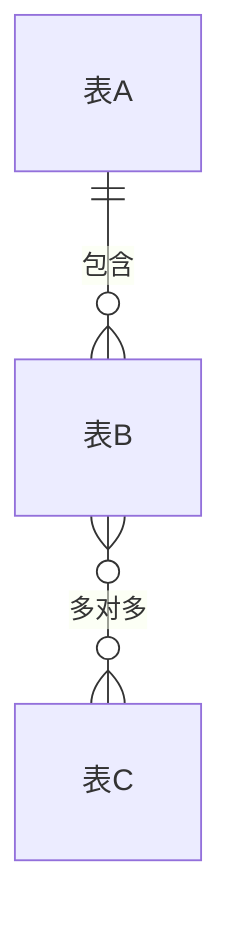

致：<客户单位全称>

编制：<你的公司名>

版本：v1.0

日期：<年月>

---

## 一、项目背景

### 1.1 贵司概况

- 企业性质：<国企 / 民企 / 初创 / ...>
- 业务范围：<一句话说明业务>
- 发展规模：
  - 成立时间：
  - 现有规模（门店 / 用户 / 产品数）：
  - 近期规划：
- 业绩体量：<上年营收 / 本年预估>
- 团队构成：<核心部门人数>

### 1.2 现有系统

| 系统 | 用途 | 本项目处置 |
|---|---|---|
| <系统 A> | | 保留 / 替换 / 衔接 |
| <系统 B> | | |

贵司的整体策略：<一句话概括信息化目标>。

---

## 二、核心痛点与需求

### 2.1 主要痛点

1. <痛点标题>：<一句话说明>
2. ...
（至少 5 条，引用客户原话增强说服力）

### 2.2 功能诉求

- <诉求 1>：<说明>
- ...

---

## 三、业务流程梳理

### 3.1 <主流程名>

### 3.2 <副流程名>

---

## 四、解决方案总览

### 4.1 <模块 1>

<说明该模块解决什么问题、怎么实现>

### 4.2 <模块 2>

### 4.3 <模块 N>

### 4.N 管理仪表盘

核心指标：
- <指标 1>
- <指标 2>

---

## 五、合作模式

| 项目 | 说明 |
|------|------|
| 搭建周期 | 方案确认后 X 周内完成 |
| 培训交付 | 线上培训，全程录屏 |
| 后续支持 | 小改动免费，新模块按工作量另算 |

---

## 六、字段级数据模型

> 以下字段设计为初版建议，实施阶段会根据贵司实际业务细节、使用习惯与数据口径灵活调整，不作为最终落地版本。

### 6.1 <表 1>

| 字段 | 类型 | 说明 |
|---|---|---|

### 6.2 <表 2>

| 字段 | 类型 | 说明 |
|---|---|---|

### 表间关系说明

---

## 七、待确认事项

| 序号 | 事项 | 责任方 | 时限 |
|------|------|--------|------|
| 1 | <事项 1> | | |
| 2 | <事项 2> | | |

---

如有任何需要调整的内容，请直接在本文档中评论标注。
