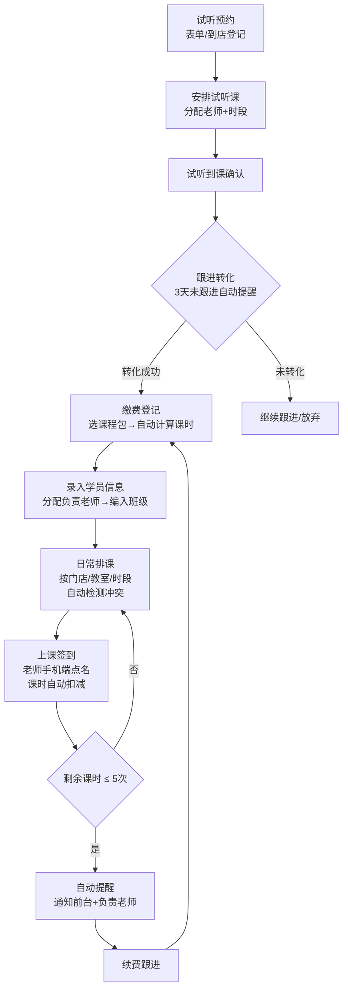
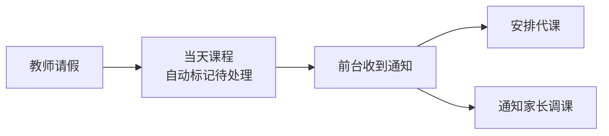
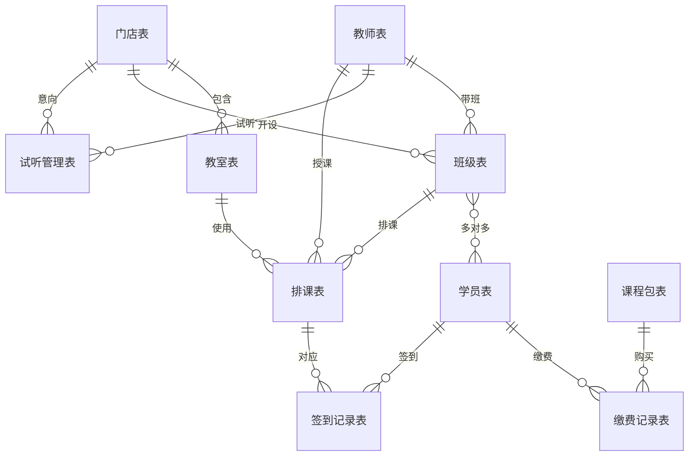

致：彩虹少儿美术

编制：万涂幻象

版本：v1.0

日期：2026年4月

---

## 一、项目背景

### 1.1 客户概况

彩虹少儿美术是一家面向 3-12 岁儿童的少儿美术培训机构，目前拥有 3 家直营门店：

| 门店 | 教室数 |
|------|--------|
| 万达广场店 | 3 间 |
| 银泰城店 | 2 间 |
| 锦绣花园社区店 | 2 间 |

团队规模：全职教师 12 人，兼职教师 5 人，前台行政 3 人。在读学员约 420 人。去年营收约 380 万元，今年目标 500 万元。

课程体系分为三个级别：启蒙班（3-5 岁，满班 8 人）、基础班（5-8 岁，满班 12 人）、提高班（8-12 岁，满班 10 人）。每节课 90 分钟。

课程包共四种：

| 课程包 | 课时数 | 价格 |
|--------|--------|------|
| 体验包 | 4 节 | 199 元 |
| 季度包 | 24 节 | 2,880 元 |
| 半年包 | 48 节 | 5,280 元 |
| 年包 | 96 节 | 9,600 元 |

课程包为通用类型，不区分级别，购买后上任何级别的课均扣一节课时。此外还有短期特训营（如暑期特训营、寒假集训班），单独收费，不从常规课程包扣减。

### 1.2 现有系统

当前没有统一的教务系统，信息散落在多个平台：

- 排课：Excel 排课，前台每周排一次后截图发到老师群
- 学员信息：部分在前台 Excel，部分在各老师微信备忘录和备注中
- 缴费：通过有赞商城收款，缴费记录在有赞后台
- 签到：老师在班级微信群点名，记在纸质本子上，月底交前台录入 Excel
- 内部沟通：已在使用飞书（标准版），审批和请假已走飞书流程

曾试用校宝约三个月后放弃。赵雅琴表示："太重了，功能特别多但是我们用不上，而且前台的小姑娘们觉得操作太复杂，后来就又退回 Excel 了。我们就是想要一个简单的、够用的系统。"

---

## 二、核心痛点与需求

### 2.1 痛点清单

痛点一：排课冲突频发

三家门店共用教师资源，前台需要同时看三个门店的 Excel 表格排课，每周都会出现一两次冲突。运营负责人陈思远描述："比如说张老师周二上午在万达店，下午就要赶去银泰店，但是有时候排课的时候前台没注意，就排重了，老师到了现场发现两边都有课，就很尴尬。"此外，调课补课改来改去，"改着改着就乱了"。

痛点二：续费盲区严重

课时消耗情况不透明，续费全靠前台记忆。赵雅琴表示："经常是家长来问说我们还剩多少课，前台才去翻记录数。""有的学员课上完了但是没有及时续费，等了两个月再打电话人家说已经不学了，其实如果我们早点提醒的话可能就续上了。"据估算，去年因跟进不及时流失的续费约二三十万元。

痛点三：信息孤岛

赵雅琴表示："三个地方的数据完全对不上。前台说这个学员还有 8 节课，老师那边记的是 6 节，有赞后台显示交了两期费用，但是到底对应多少课时又不清楚。每个月底结算的时候都要花两三天去核对。"

痛点四：试听转化跟进缺失

每月约四五十个试听，转化率约 30%。赵雅琴表示："试听完了之后没有人系统地去跟进，谁负责跟进、跟进到什么阶段了、家长是什么意向，这些都没有记录。"

### 2.2 功能诉求

1. 统一学员信息库，一处录入、处处可用
2. 排课自动检测教师时间冲突，支持调课补课
3. 上课签到后课时自动扣减，剩余课时低于 5 次自动提醒
4. 试听登记到转化的全流程跟进
5. 教师课时自动统计，月底直接出结算数据
6. 缴费记录关联学员，支持分期和到期提醒
7. 校长仪表盘：各门店在读人数、月度营收、续费率、试听转化率、教师课时排名
8. 手机端老师可查课表和签到点名，前台可在手机端操作
9. 试听预约表单，家长在微信中扫码填写，无需安装飞书
10. 权限控制：老师只看自己的课表和学员，前台看全部，校长为管理员；手机号和缴费金额对老师隐藏

---

## 三、业务流程梳理

### 3.1 学员全生命周期

### 3.2 请假与补课流程

### 3.3 教师请假流程

---

## 四、解决方案总览

基于飞书多维表格搭建轻量教务管理系统，共六个核心模块。

### 4.1 学员管理

建立统一的学员信息库，每个孩子一条记录，通过家长手机号关联同一家庭的多个孩子。学员不绑定门店，而是绑定到具体班级（多对多关系，一个学员可以同时在启蒙班和基础班）。支持新学员录入、升班变更、退费标记等操作。前台两三分钟即可完成新学员的全部登记流程。

### 4.2 排课管理

以门店、教室、时段为三个维度排课，自动检测教师时间冲突：同一老师同一时段只能出现在一个门店，系统自动提示冲突。常规课和短期特训营统一在排课表中管理，共享教室和教师资源。支持调课、补课、代课操作，请假学员标记缺课不扣课时，待补课列表一目了然。每个老师每天最多排 3 节课。

### 4.3 课时与续费

每次上课签到后自动扣减课时。剩余课时 ≤ 5 次时，系统通过飞书消息自动通知前台和负责老师，生成续费待跟进列表。课时有效期字段到期提醒但不强制锁定，前台自行判断续费或延期。赵雅琴表示："老师上完课直接在手机上点一下谁到了谁没到，然后课时自动扣，剩余课时少于 5 次就自动提醒，这样前台就知道该联系家长续费了。"

### 4.4 试听转化

试听预约表单对外开放，家长在微信中扫码填写（姓名、孩子年龄、手机号、意向门店），提交后自动进入试听待安排列表。前台分配试听老师和时段，试听后记录到课情况。后续跟进设状态、意向、负责人等字段，三天未跟进自动提醒。最终统计各老师试听转化率，为教学质量评估提供数据支撑。

### 4.5 教师管理

教师信息表记录基本信息、可教授课程、可排课时段。与排课表联动后，月底自动统计每位老师的课时数，直接用于课时费结算。全职老师底薪 4,000 元 + 课时费 80 元/节，兼职老师课时费 120 元/节，系统自动计算月度应付金额。兼职老师通过飞书外部协作或团队功能加入，权限与全职老师一致。

### 4.6 缴费记录

缴费记录关联学员和课程包，收款仍走有赞商城，飞书端手动登记缴费信息。支持分期付款：记录已付金额、待付金额、下次付款日期，到期前自动提醒前台。退费按剩余课时折算，在缴费表中标记退费金额和日期。促销活动（双十一折扣、老带新赠课时等）在备注字段记录即可。

### 4.7 校长仪表盘

为管理层提供全局数据视图，核心指标包括：

- 各门店在读人数
- 月度营收
- 续费率
- 试听转化率
- 教师课时排名

以图表形式展示，打开即可掌握全局，无需查看明细数据。

---

## 五、合作模式

| 项目 | 说明 |
|------|------|
| 报价方式 | 固定报价，根据方案确认后的最终复杂度确定 |
| 后续调整 | 小改动（加字段、调视图）免费；新增整个模块按工作量另算 |
| 搭建周期 | 方案确认后一周内完成搭建和示例数据录入 |
| 数据导入 | 客户整理 Excel 后由搭建方批量导入（数据准确性由客户确认） |
| 培训交付 | 线上培训 1-1.5 小时，分管理层/前台和教师两个部分，全程录屏供后续新人学习 |
| 试运行期 | 搭建完成后两周试运行，期间问题随时调整 |
| 新老系统并行 | 试运行期间保留原 Excel 系统，至少并行一个月 |
| 后续支持 | 交付后持续提供咨询支持 |

---

## 六、字段级数据模型

### 7.1 门店表

| 字段名 | 字段类型 | 说明 |
|--------|----------|------|
| 门店名称 | 文本 | 如"万达广场店""银泰城店""锦绣花园社区店" |
| 地址 | 文本 | 门店详细地址 |
| 教室数量 | 数字 | 该门店的教室总数 |
| 联系电话 | 电话 | 门店前台电话 |
| 状态 | 单选 | 营业中 / 筹备中 / 已关闭 |

### 7.2 教室表

| 字段名 | 字段类型 | 说明 |
|--------|----------|------|
| 教室名称 | 文本 | 如"万达-教室1" |
| 所属门店 | 关联（门店表） | 教室所属的门店 |
| 容纳人数 | 数字 | 教室最大容量 |
| 状态 | 单选 | 可用 / 维护中 |

### 7.3 教师表

| 字段名 | 字段类型 | 说明 |
|--------|----------|------|
| 教师姓名 | 文本 | 教师全名 |
| 手机号 | 电话 | 联系电话 |
| 类型 | 单选 | 全职 / 兼职 |
| 可教授级别 | 多选 | 启蒙班 / 基础班 / 提高班 |
| 可排课时段 | 文本 | 描述可排课的时间段 |
| 底薪 | 货币 | 全职 4,000 元；兼职为空 |
| 课时费单价 | 货币 | 全职 80 元/节；兼职 120 元/节 |
| 月度课时数 | 数字（公式） | 从排课签到表自动汇总当月实际授课数 |
| 月度应付金额 | 货币（公式） | 底薪 + 课时费单价 x 月度课时数 |
| 入职日期 | 日期 | 入职时间 |
| 状态 | 单选 | 在职 / 离职 |

### 7.4 班级表

| 字段名 | 字段类型 | 说明 |
|--------|----------|------|
| 班级名称 | 文本 | 如"启蒙A班""基础周末班" |
| 课程级别 | 单选 | 启蒙班 / 基础班 / 提高班 |
| 授课教师 | 关联（教师表） | 该班级的主讲老师 |
| 所属门店 | 关联（门店表） | 班级所在门店 |
| 上课教室 | 关联（教室表） | 固定使用的教室 |
| 满班人数 | 数字 | 启蒙 8 人 / 基础 12 人 / 提高 10 人 |
| 当前人数 | 数字（公式） | 从学员-班级关联表自动统计 |
| 上课时段 | 文本 | 如"周二 16:00-17:30" |
| 状态 | 单选 | 开班中 / 已结班 |

### 7.5 学员表

| 字段名 | 字段类型 | 说明 |
|--------|----------|------|
| 学员姓名 | 文本 | 孩子姓名 |
| 性别 | 单选 | 男 / 女 |
| 出生日期 | 日期 | 用于自动计算年龄 |
| 年龄 | 数字（公式） | 根据出生日期自动计算 |
| 家长姓名 | 文本 | 主要联系家长 |
| 家长手机号 | 电话 | 同一手机号可关联同一家庭的多个孩子 |
| 所在班级 | 关联（班级表） | 多对多关系，一个学员可在多个班级 |
| 负责老师 | 关联（教师表） | 学员的主要负责老师 |
| 当前课程包 | 关联（缴费记录表） | 关联最近一次有效缴费记录 |
| 总课时 | 数字 | 当前课程包的总课时数 |
| 已用课时 | 数字（公式） | 从签到记录自动汇总 |
| 剩余课时 | 数字（公式） | 总课时 - 已用课时 |
| 待补课次数 | 数字（公式） | 从签到记录中缺课且未补课的记录数 |
| 课时有效期 | 日期 | 课程包购买之日起一年，到期提醒但不强制锁定 |
| 入学日期 | 日期 | 在本机构的入学时间 |
| 状态 | 单选 | 在读 / 休学 / 已退费 / 已结业 |
| 备注 | 文本 | 如"从 XX 机构转来"等补充信息 |

### 7.6 课程包表

| 字段名 | 字段类型 | 说明 |
|--------|----------|------|
| 课程包名称 | 文本 | 如"季度包""暑期特训营" |
| 类型 | 单选 | 常规包 / 体验包 / 短期特训营 |
| 课时数 | 数字 | 该课程包包含的总课时 |
| 价格 | 货币 | 标准售价 |
| 有效期（天） | 数字 | 默认 365 天 |

### 7.7 排课表

| 字段名 | 字段类型 | 说明 |
|--------|----------|------|
| 日期 | 日期 | 上课日期 |
| 时段 | 单选 | 如"16:00-17:30""10:00-11:30"等 |
| 门店 | 关联（门店表） | 上课门店 |
| 教室 | 关联（教室表） | 上课教室 |
| 班级 | 关联（班级表） | 上课班级 |
| 授课教师 | 关联（教师表） | 上课老师（用于冲突检测：同一教师同一日期同一时段不可重复） |
| 课程类型 | 单选 | 常规课 / 补课 / 特训营 |
| 状态 | 单选 | 正常 / 已取消 / 待处理（教师请假时自动标记） |
| 备注 | 文本 | 调课、代课等说明 |

### 7.8 签到记录表

| 字段名 | 字段类型 | 说明 |
|--------|----------|------|
| 排课记录 | 关联（排课表） | 关联到具体某节课 |
| 学员 | 关联（学员表） | 签到的学员 |
| 签到状态 | 单选 | 已到 / 缺课 / 请假 / 已补课 |
| 签到时间 | 日期时间 | 老师点名签到的时间 |
| 是否扣课时 | 复选框 | 已到和已补课扣课时，缺课和请假不扣 |
| 操作人 | 人员 | 执行签到操作的老师 |

### 7.9 缴费记录表

| 字段名 | 字段类型 | 说明 |
|--------|----------|------|
| 学员 | 关联（学员表） | 缴费的学员 |
| 课程包 | 关联（课程包表） | 购买的课程包类型 |
| 缴费金额 | 货币 | 本次实际缴纳金额 |
| 缴费日期 | 日期 | 付款日期 |
| 支付方式 | 单选 | 有赞支付 / 现金 / 转账 |
| 分期状态 | 单选 | 已付清 / 分期中 |
| 已付金额 | 货币 | 累计已付金额 |
| 待付金额 | 货币（公式） | 缴费金额 - 已付金额 |
| 下次付款日期 | 日期 | 分期付款的下次付款日期，到期前自动提醒 |
| 退费金额 | 货币 | 如有退费，记录退费金额 |
| 退费日期 | 日期 | 退费处理日期 |
| 备注 | 文本 | 如"双十一活动 8 折""老带新赠 4 课时"等促销说明 |
| 操作人 | 人员 | 登记缴费的前台 |

### 7.10 试听管理表

| 字段名 | 字段类型 | 说明 |
|--------|----------|------|
| 孩子姓名 | 文本 | 试听孩子的姓名 |
| 孩子年龄 | 数字 | 试听孩子的年龄 |
| 家长手机号 | 电话 | 联系电话 |
| 来源渠道 | 单选 | 到店 / 朋友圈 / 小红书 / 转介绍 / 其他 |
| 意向门店 | 关联（门店表） | 家长希望试听的门店 |
| 试听老师 | 关联（教师表） | 安排的试听老师 |
| 试听日期 | 日期 | 安排的试听时间 |
| 试听时段 | 单选 | 试听的具体时段 |
| 到课情况 | 单选 | 已到 / 未到 / 已取消 |
| 试听状态 | 单选 | 待安排 / 已安排 / 已试听 / 已转化 / 已放弃 |
| 家长意向 | 单选 | 强意向 / 考虑中 / 无意向 |
| 跟进负责人 | 人员 | 负责后续跟进的人 |
| 最近跟进日期 | 日期 | 上一次跟进的日期 |
| 跟进记录 | 文本 | 每次跟进的简要记录 |
| 转化日期 | 日期 | 正式报名的日期（如转化成功） |
| 关联学员 | 关联（学员表） | 转化成功后关联到学员记录 |

### 表间关系说明

学员与班级的多对多关系通过飞书多维表格的双向关联字段实现，无需单独的中间表。

---

## 七、待确认事项

| 序号 | 事项 | 责任方 | 时限 |
|------|------|--------|------|
| 1 | 飞书企业版费用确认（高级权限和工作流自动化是否需要升级） | 李祥瑞 | 方案交付前 |
| 2 | 现有学员 Excel 数据整理（姓名、年龄、课程包、剩余课时、门店、负责老师、家长手机号） | 赵雅琴/前台 | 两三天内 |
| 3 | 兼职教师加入飞书组织架构 | 陈思远 | 搭建前 |
| 4 | 剩余课时数据核实（现有数据可能不完全准确，系统上线后逐步与家长核对） | 赵雅琴/前台 | 系统上线后 |
| 5 | 培训时间确认（建议安排在下午） | 双方 | 搭建完成时 |
| 6 | 家长端查询需求是否纳入后期迭代（当前飞书多维表格不支持外部用户直接查数据） | 赵雅琴 | 后续 |
| 7 | 教材画材管理模块是否纳入后期迭代 | 赵雅琴 | 后续 |
| 8 | 教师请假审批与飞书审批流打通是否纳入后期迭代 | 双方 | 后续 |

---

如有任何需要调整的内容，请直接在本文档中评论标注，我来修改。
